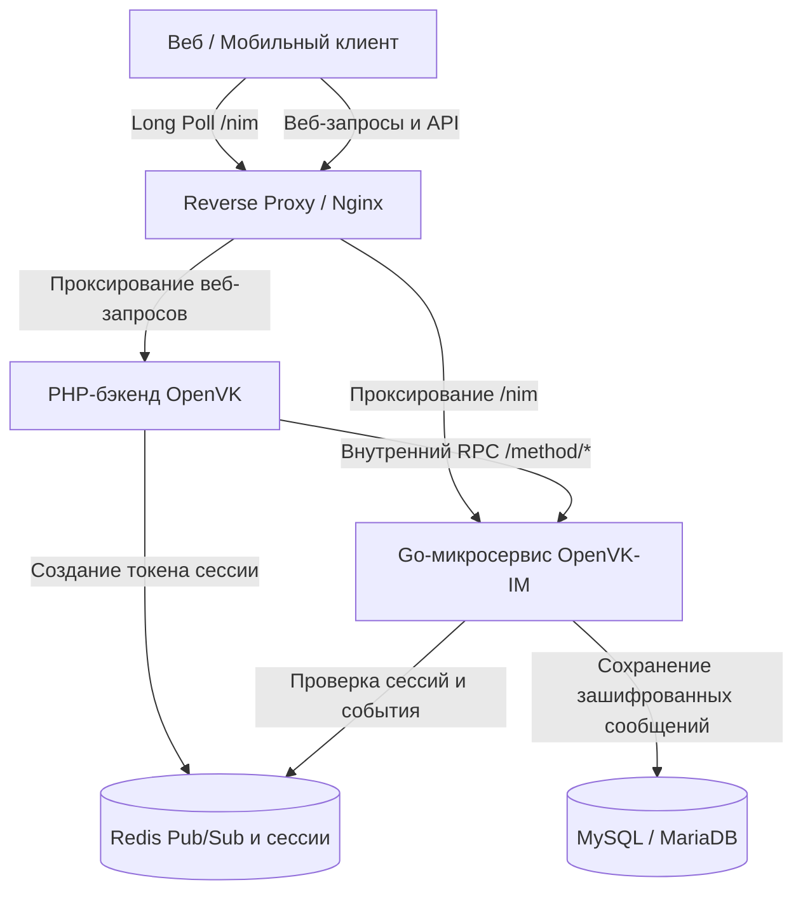

<p align="center">
  
</p>

<h1 align="center">OpenVK Instant Messenger (OpenVK-IM)</h1>

<p align="center">
  <b>Высокопроизводительный, безопасный микросервис обмена сообщениями в реальном времени и Long Poll для <a href="https://github.com/openvk">OpenVK</a>.</b>
</p>

<p align="center">
  
  
  
  
  
</p>

<p align="center">
  <a href="README.md">English</a> •
  <a href="README-ru.md"><b>Русский</b></a>
</p>

---

## Обзор

**OpenVK-IM** — это специализированный микросервис обмена мгновенными сообщениями, написанный на Go, предназначенный для обработки высоконагруженных коммуникаций в реальном времени, рассылки событий Long Poll, шифрования сообщений и управления диалогами/беседами для **OpenVK**.

Благодаря переносу ресурсоёмких операций реального времени, постоянных Long Poll соединений и поисковой индексации с основного PHP-бэкенда на асинхронный Go-сервис, OpenVK-IM обеспечивает низкую задержку доставки сообщений, эффективное использование ресурсов и горизонтально масштабируемую отправку событий.

> [!WARNING]
> **Уведомление о внутреннем сервисе**: OpenVK-IM предназначен для работы в качестве внутреннего микросервиса. Только эндпоинт Long Poll (`/nim`) должен быть доступен конечным пользователям (через reverse proxy). Все эндпоинты `/method/*` должны оставаться закрытыми для внешнего мира и быть доступны только внутренним сервисам бэкенда.

---

## Возможности

- **Движок Long Poll реального времени**: Полная поддержка протокола VK Long Poll (`/nim`, `messages.getLongPollServer`, `messages.getLongPollHistory`) с согласованием версий, битовыми масками режимов (вложения, расширенные события, счетчики PTS, случайные ID) и рассылкой событий за доли миллисекунды.
- **Шифрование данных при хранении (Encrypted at Rest)**: Конфиденциальные данные (текст сообщений, вложения, настройки и служебные метаданные) шифруются с использованием **AES-256-GCM**.
- **Поиск по слепому индексу (Blind Index Search)**: Безопасный полнотекстовый поиск сообщений по зашифрованному содержимому с использованием криптографического слепого индексирования (**HMAC-SHA256**), предотвращающий хранение открытого текста в базе данных.
- **Совместимость с несколькими версиями VK API**: Прозрачная поддержка как устаревших клиентов (VK API 5.20 / 5.80), так и современных спецификаций API (VK API 5.199+).
- **Продвинутое управление беседами и диалогами**:
  - Личные сообщения 1-на-1 (между пользователями, а также диалоги с сообществами/группами).
  - Групповые чаты (беседы) с несколькими участниками, ролями (администраторы, создатели) и ссылками-приглашениями.
  - Периоды присутствия участников (гибкая видимость сообщений на основе времени входа/выхода из беседы).
  - Сервисные сообщения (пользователь присоединился, покинул чат, изменилось название, обновлена фотография, сообщение закреплено/откреплено).
  - Отслеживание статуса сообщений: счетчики прочитанных/непрочитанных, флаги важных сообщений, операции мягкого удаления (soft-delete) и восстановления.
- **Redis Pub/Sub и In-Memory Broadcaster**: Мгновенная маршрутизация событий между экземплярами микросервиса с использованием каналов Redis и неблокирующих подписчиков на каналах Go.
- **Инструменты миграции**: Встроенные CLI-команды для инициализации схемы базы данных и высокопроизводительной пакетной миграции из устаревших таблиц сообщений OpenVK.

---

## Архитектура



---

## Стек технологий

- **Язык**: [Go](https://go.dev/) 1.25+
- **HTTP-фреймворк**: [Gin Web Framework](https://github.com/gin-gonic/gin)
- **ORM и база данных**: [GORM](https://gorm.io/) с драйвером MySQL / MariaDB
- **Кэш и Pub/Sub**: [go-redis v9](https://github.com/redis/go-redis)
- **Криптография**: AES-256-GCM (аутентифицированное шифрование), HMAC-SHA256 (слепые индексы)

---

## Требования для запуска

Перед запуском OpenVK-IM убедитесь, что у вас установлены:

- **Go 1.25+** (при сборке из исходного кода) или **Docker и Docker Compose**
- **MySQL 5.7+ / 8.0+** или **MariaDB 10.3+**
- **Redis 6.0+**
- Работающий экземпляр **OpenVK** (необязательно для изолированного тестирования, требуется для полной интеграции)

---

## Конфигурация

Скопируйте файл `.env.example` в `.env` и настройте переменные:

```bash
cp .env.example .env
```

### Переменные окружения

| Переменная | По умолчанию | Описание |
| :--- | :--- | :--- |
| `DB_USER` | `root` | Имя пользователя базы данных MySQL |
| `DB_PASS` | `root` | Пароль базы данных MySQL |
| `DB_HOST` | `127.0.0.1` | Хост базы данных MySQL |
| `DB_PORT` | `3306` | Порт базы данных MySQL |
| `DB_NAME` | `openvk_im` | Имя базы данных для OpenVK-IM |
| `REDIS_HOST` | `127.0.0.1` | Хост сервера Redis |
| `REDIS_PORT` | `6379` | Порт сервера Redis |
| `REDIS_PASS` | _(пусто)_ | Пароль Redis (если настроен) |
| `REDIS_DB` | `0` | Номер базы данных Redis |
| `APP_PORT` | `8080` | Порт, на котором запускается HTTP-сервер |
| `APP_ENV` | `production` | Режим окружения (`development` или `production`) |
| `SECRET_KEY` | _обязательно_ | **Мастер-ключ шифрования** (должен быть **>= 64 байт**), используемый для AES-GCM и слепого индексирования HMAC |
| `MODERATOR_TOKEN` | _(пусто)_ | Опциональный сервисный токен для внутреннего доступа модераторов |

> [!IMPORTANT]
> Ключ `SECRET_KEY` должен содержать не менее 64 символов и храниться в строгой тайне. Изменение этого ключа сделает ранее зашифрованные сообщения недоступными для расшифровки.

---

## Установка и запуск

### С использованием Docker Compose (рекомендуется)

1. Убедитесь, что ваш файл `.env` настроен.
2. Соберите и запустите контейнер:

```bash
docker compose up -d --build
```

### Запуск из исходного кода

1. **Загрузка зависимостей**:
   ```bash
   go mod download
   ```

2. **Инициализация схемы базы данных**:
   ```bash
   go run main.go db create
   ```

3. **Запуск сервера**:
   ```bash
   go run main.go start
   ```

---

## Команды CLI

Исполняемый файл поддерживает следующие подкоманды:

```bash
# Запуск HTTP / Long Poll сервера (действие по умолчанию)
./ovk-im-server start

# Автоматическое создание или обновление таблиц и индексов базы данных
./ovk-im-server db create

# Потоковая миграция устаревших сообщений из OpenVK в зашифрованное хранилище OpenVK-IM
./ovk-im-server db migrate-legacy
```

---

## API и эндпоинты

### 1. Публичные эндпоинты

- `GET /nim` — **Поток событий Long Poll**  
  Используется клиентами для мгновенного получения событий сообщений, активности набора текста и отметок о прочтении.  
  *Параметры*: `key`, `ts`, `wait`, `mode`, `version`, `described`

### 2. Аутентификация

Запросы к `/method/*` требуют активного ключа сессии в Redis (`im:session:api:<key>` &rarr; `userID`):
- **Заголовок (рекомендуется)**: `Authorization: Bearer <key>`
- **Параметр запроса**: `?key=<key>`

### 3. Внутренние эндпоинты (`/method/:methodName`)

#### Операции с сообщениями
- `messages.get` — Получение входящих/исходящих сообщений
- `messages.send` — Отправка прямого сообщения или сообщения в беседу
- `messages.edit` — Редактирование существующего сообщения
- `messages.delete` — Удаление сообщений (для текущего пользователя или для всех)
- `messages.restore` — Восстановление ранее удаленного сообщения
- `messages.search` — Поиск сообщений по зашифрованным слепым индексам
- `messages.getById` — Получение сообщений по глобальным ID
- `messages.getByConversationMessageId` — Получение сообщений по локальным ID в рамках чата
- `messages.markAsRead` — Пометка сообщений как прочитанных
- `messages.markAsImportant` / `messages.getImportantMessages` — Управление важными/избранными сообщениями
- `messages.pin` / `messages.unpin` — Закрепление или открепление сообщения в беседе

#### Управление беседами и чатами
- `messages.createChat` — Создание новой групповой беседы
- `messages.editChat` — Изменение названия беседы
- `messages.setChatPhoto` / `messages.deleteChatPhoto` — Управление аватаром беседы
- `messages.addChatUser` / `messages.removeChatUser` — Добавление или исключение участников
- `messages.getConversations` / `messages.getDialogs` — Получение списка диалогов/бесед пользователя
- `messages.getConversationMembers` / `messages.getChatUsers` — Получение списка участников беседы
- `messages.getConversationsById` — Получение метаданных бесед
- `messages.searchConversations` / `messages.searchDialogs` — Поиск бесед по названию/тексту
- `messages.markAsAnsweredConversation` — Пометка беседы как отвеченной
- `messages.markAsImportantConversation` — Пометка беседы как важной
- `messages.deleteConversation` / `messages.deleteDialog` — Удаление всей истории беседы

#### История и статус
- `messages.getHistory` — Получение истории чата с пагинацией
- `messages.getHistoryAttachments` — Получение вложений беседы
- `messages.setActivity` — Передача статуса набора текста или записи голосового сообщения

#### Управление Long Poll
- `messages.getLongPollServer` — Получение данных доступа к Long Poll и URL сервера
- `messages.getLongPollHistory` — Получение пропущенных событий по PTS / TS

#### Кастомные расширения IM
- `im.getUnreadMessages` — Подсчет общего количества непрочитанных сообщений
- `im.getUnreadConversations` — Подсчет общего количества непрочитанных диалогов
- `im.getPinnedMessage` — Получение закрепленного сообщения для диалога
- `im.checkPeerExist` — Проверка существования беседы/диалога
- `im.sendAction` — Отправка пользовательских системных действий в чат
- `im.getMe` — Получение ID текущего аутентифицированного пользователя

---

## Рекомендации по безопасности

1. **Настройка Reverse Proxy**: Убедитесь, что ваш Nginx / reverse proxy проксирует в открытый доступ только `/nim`. Заблокируйте внешний доступ к `/method/*`.
   ```nginx
   # Публичный эндпоинт Long Poll
   location /nim {
       proxy_pass http://127.0.0.1:8080/nim;
       proxy_http_version 1.1;
       proxy_read_timeout 120s;
   }

   # Запрет внешнего доступа к внутренним методам
   location /method {
       internal;
   }
   ```
2. **Безопасность и ротация ключей**: Храните `SECRET_KEY` в надежном месте и делайте резервные копии. Он обеспечивает криптографическую основу для AES-GCM и слепого индексирования HMAC.

---

## Лицензия

Этот проект лицензирован под **лицензией MIT** — подробности см. в файле [LICENSE](LICENSE).

Разработано с ❤️ для экосистемы [OpenVK](https://github.com/openvk).
