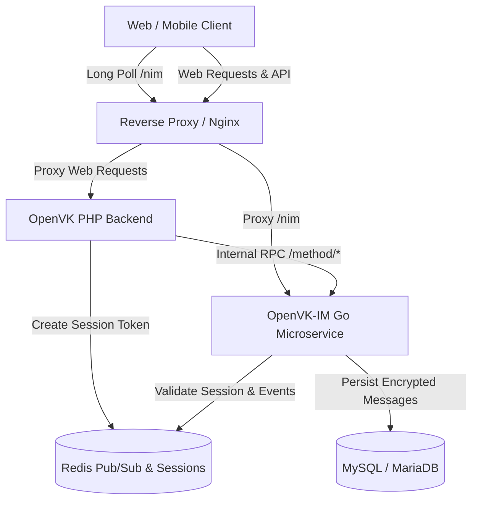

<p align="center">
  
</p>

<h1 align="center">OpenVK Instant Messenger (OpenVK-IM)</h1>

<p align="center">
  <b>High-performance, secure, real-time messaging and Long Poll microservice for <a href="https://github.com/openvk">OpenVK</a>.</b>
</p>

<p align="center">
  
  
  
  
  
</p>

<p align="center">
  <a href="README.md"><b>English</b></a> •
  <a href="README-ru.md">Русский</a>
</p>

---

## Overview

**OpenVK-IM** is a dedicated instant messaging microservice built in Go to handle high-concurrency real-time communication, Long Poll event broadcasting, message encryption, and conversation management for **OpenVK**.

By offloading heavy real-time operations, continuous Long Poll connections, and search indexation from the primary PHP backend to an asynchronous Go service, OpenVK-IM provides low-latency messaging, efficient resource utilization, and horizontally scalable event dispatching.

> [!WARNING]
> **Internal Service Notice**: OpenVK-IM is intended to run as an internal microservice. Only the Long Poll endpoint (`/nim`) should be accessible by end users (via reverse proxy). All `/method/*` endpoints must remain private to backend services.

---

## Features

- **Real-Time Long Poll Engine**: Full support for VK Long Poll protocol (`/nim`, `messages.getLongPollServer`, `messages.getLongPollHistory`) with version negotiation, mode bitmasks (attachments, extended events, PTS counters, random IDs), and sub-millisecond dispatching.
- **Encrypted at Rest**: Sensitive data (message text, attachments, settings, and service metadata) is encrypted using **AES-256-GCM**.
- **Blind Index Search**: Secure full-text message search over encrypted content using cryptographic blind indexing (**HMAC-SHA256**), preventing plaintext exposure in the database.
- **Multi-Version VK API Compatibility**: Transparent support for legacy clients (VK API 5.20 / 5.80) up to modern API specifications (VK API 5.199+).
- **Rich Conversation Management**:
  - Direct 1-on-1 messages (user-to-user and group/community dialogues).
  - Multi-participant group chats with roles (admins, creators) and invite links.
  - Member presence periods (fine-grained message visibility based on join/leave timelines).
  - Service action messages (user joined, left, title updated, photo changed, message pinned/unpinned).
  - Message status tracking: read/unread counters, important flags, and soft-delete/restore operations.
- **Redis Pub/Sub & In-Memory Broadcaster**: Instant event routing across microservice instances using Redis channels and non-blocking Go channel subscribers.
- **Migration Tools**: Built-in CLI commands for database schema initialization and high-throughput batch migration from legacy OpenVK message tables.

---

## Architecture



---

## Tech Stack

- **Language**: [Go](https://go.dev/) 1.25+
- **HTTP Framework**: [Gin Web Framework](https://github.com/gin-gonic/gin)
- **ORM & Database**: [GORM](https://gorm.io/) with MySQL / MariaDB driver
- **Cache & Pub/Sub**: [go-redis v9](https://github.com/redis/go-redis)
- **Cryptography**: AES-256-GCM (Authenticated Encryption), HMAC-SHA256 (Blind Indexes)

---

## Prerequisites

Before running OpenVK-IM, ensure you have:

- **Go 1.25+** (if building from source) or **Docker & Docker Compose**
- **MySQL 5.7+ / 8.0+** or **MariaDB 10.3+**
- **Redis 6.0+**
- Running instance of **OpenVK** (optional for standalone testing, required for full integration)

---

## Configuration

Copy `.env.example` to `.env` and adjust the variables:

```bash
cp .env.example .env
```

### Environment Variables

| Variable | Default | Description |
| :--- | :--- | :--- |
| `DB_USER` | `root` | MySQL database username |
| `DB_PASS` | `root` | MySQL database password |
| `DB_HOST` | `127.0.0.1` | MySQL host address |
| `DB_PORT` | `3306` | MySQL port |
| `DB_NAME` | `openvk_im` | Database name for OpenVK-IM |
| `REDIS_HOST` | `127.0.0.1` | Redis server host |
| `REDIS_PORT` | `6379` | Redis server port |
| `REDIS_PASS` | _(empty)_ | Redis password (if configured) |
| `REDIS_DB` | `0` | Redis database index |
| `APP_PORT` | `8080` | Port on which the HTTP server listens |
| `APP_ENV` | `production` | Environment mode (`development` or `production`) |
| `SECRET_KEY` | _required_ | **Master encryption key** (must be **>= 64 bytes**) used for AES-GCM and HMAC blind indexing |
| `MODERATOR_TOKEN` | _(empty)_ | Optional service token for internal moderation access |

> [!IMPORTANT]
> The `SECRET_KEY` must be at least 64 characters long and kept strictly secret. Changing this key will make previously encrypted messages unreadable.

---

## Installation & Running

### Using Docker Compose (Recommended)

1. Ensure your `.env` file is configured.
2. Build and start the container:

```bash
docker compose up -d --build
```

### Running from Source

1. **Download dependencies**:
   ```bash
   go mod download
   ```

2. **Initialize the database schema**:
   ```bash
   go run main.go db create
   ```

3. **Start the server**:
   ```bash
   go run main.go start
   ```

---

## CLI Commands

The executable supports the following subcommands:

```bash
# Start the HTTP / Long Poll server (default action)
./ovk-im-server start

# Automatically create or migrate database tables & indexes
./ovk-im-server db create

# Stream & migrate legacy messages from OpenVK into encrypted OpenVK-IM storage
./ovk-im-server db migrate-legacy
```

---

## API & Endpoints

### 1. Public Endpoints

- `GET /nim` — **Long Poll Event Stream**  
  Used by clients to receive instant message events, typing activity, and read receipts.  
  *Parameters*: `key`, `ts`, `wait`, `mode`, `version`, `described`

### 2. Authentication

Requests to `/method/*` require an active session key in Redis (`im:session:api:<key>` &rarr; `userID`):
- **Header (Recommended)**: `Authorization: Bearer <key>`
- **Query Parameter**: `?key=<key>`

### 3. Internal Endpoints (`/method/:methodName`)

#### Message Operations
- `messages.get` — Retrieve incoming/outgoing messages
- `messages.send` — Send a direct or group message
- `messages.edit` — Edit an existing message
- `messages.delete` — Delete messages (for current user or for everyone)
- `messages.restore` — Restore a previously deleted message
- `messages.search` — Search messages via encrypted blind indexes
- `messages.getById` — Retrieve messages by global IDs
- `messages.getByConversationMessageId` — Retrieve messages by chat local IDs
- `messages.markAsRead` — Mark messages as read
- `messages.markAsImportant` / `messages.getImportantMessages` — Manage starred/important messages
- `messages.pin` / `messages.unpin` — Pin or unpin a message in a conversation

#### Conversation & Chat Management
- `messages.createChat` — Create a new group chat
- `messages.editChat` — Update chat title
- `messages.setChatPhoto` / `messages.deleteChatPhoto` — Manage chat avatar
- `messages.addChatUser` / `messages.removeChatUser` — Add or kick participants
- `messages.getConversations` / `messages.getDialogs` — List user conversations
- `messages.getConversationMembers` / `messages.getChatUsers` — List conversation members
- `messages.getConversationsById` — Retrieve conversation metadata
- `messages.searchConversations` / `messages.searchDialogs` — Search conversations by title/text
- `messages.markAsAnsweredConversation` — Mark conversation as answered
- `messages.markAsImportantConversation` — Mark conversation as important
- `messages.deleteConversation` / `messages.deleteDialog` — Delete entire conversation history

#### History & Status
- `messages.getHistory` — Fetch chat history with pagination
- `messages.getHistoryAttachments` — Retrieve conversation attachments
- `messages.setActivity` — Broadcast typing or voice recording status

#### Long Poll Management
- `messages.getLongPollServer` — Obtain Long Poll credentials and server URL
- `messages.getLongPollHistory` — Retrieve missed events by PTS / TS

#### Custom IM Extensions
- `im.getUnreadMessages` — Count total unread messages
- `im.getUnreadConversations` — Count total unread conversations
- `im.getPinnedMessage` — Fetch pinned message for a peer
- `im.checkPeerExist` — Check if a conversation exists
- `im.sendAction` — Send custom system actions into a chat
- `im.getMe` — Get current authenticated user ID

---

## Security Best Practices

1. **Reverse Proxy Configuration**: Ensure your Nginx / reverse proxy only forwards `/nim` to OpenVK-IM from the public web. Block external access to `/method/*`.
   ```nginx
   # Public Long Poll endpoint
   location /nim {
       proxy_pass http://127.0.0.1:8080/nim;
       proxy_http_version 1.1;
       proxy_read_timeout 120s;
   }

   # Prevent external access to internal methods
   location /method {
       internal;
   }
   ```
2. **Key Rotation & Safety**: Keep your `SECRET_KEY` safe and backed up. It provides the cryptographic foundation for AES-GCM and HMAC blind indexing.

---

## License

This project is licensed under the **MIT License** — see the [LICENSE](LICENSE) file for details.

Developed with ❤️ for the [OpenVK](https://github.com/openvk) ecosystem.